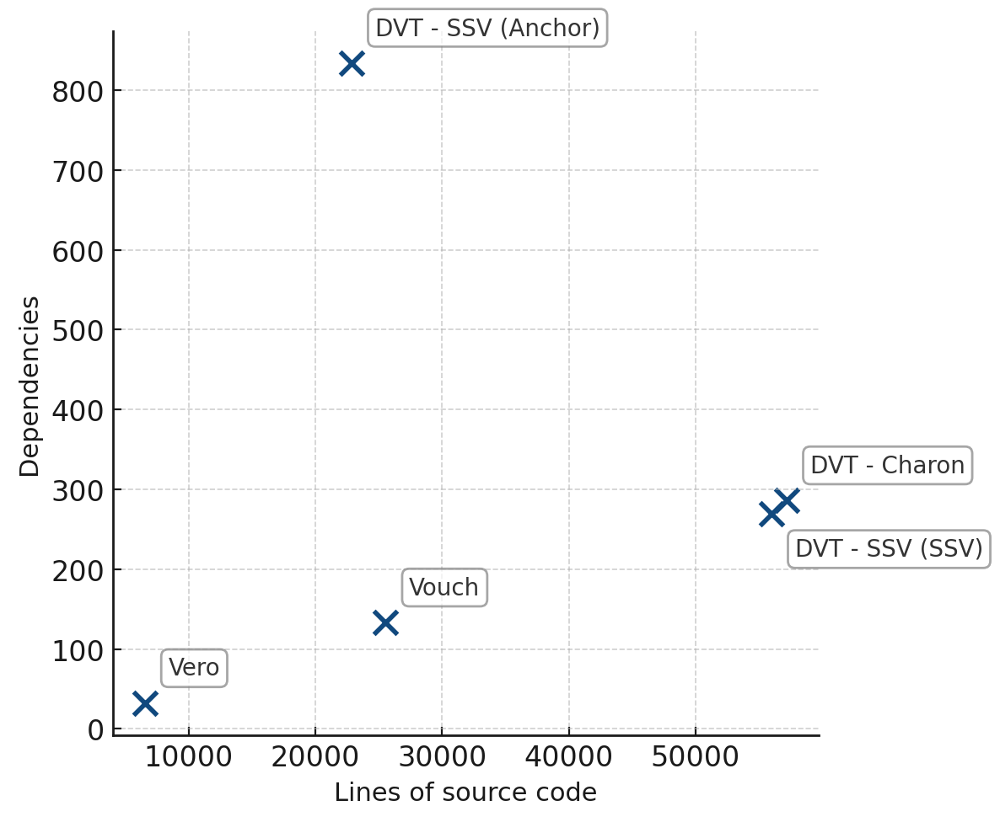

# Vero

**Vero** is a multi-node validator client designed to
**protect validators from client bugs**. It does this by cross-checking
the blockchain state across multiple client implementations
before submitting attestations.

Vero works on both **Ethereum** and **Gnosis Chain**,
and is compatible with all CL and EL clients.

___

## Design goals

### 1. Multi-node

Vero is designed to take full advantage of client diversity by
seamlessly combining data from multiple clients at the same time.

_(This is different from a fallback setup, where secondary nodes
are only used if the primary client goes offline.)_

### 2. Secure

Validator clients form a critical part of staking infrastructure
where security must be taken extremely seriously.

To support this goal:
- Vero never has direct access to validator keys.

  Instead, it works exclusively with **remote signers**.
- External dependencies are kept to a minimum, reducing the risk
  of supply chain attacks.

### 3. Simple

Vero’s codebase is intentionally kept small and focused.
Less code means fewer potential bugs, making it easier to audit
and reason about.

_Counted using cloc on September 20th 2025, tests excluded_

### 4. Observable

Understanding validator performance can be challenging.

In support of this goal, Vero provides:
- Clear, human-readable logs
- Detailed metrics and pre-built dashboards
- Rich tracing data

Together, these help node operators better understand and improve
their setups.

### 5. Compatible

Vero must be compatible with all major CL and EL clients
so it can reliably compare their views of the chain
and determine which chain is safe to follow.

In addition the above, Vero also supports industry standards like:
- [Ethereum Remote Signing API](https://github.com/ethereum/remote-signing-api)
  (used by Web3Signer)
- [Ethereum Keymanager API](https://github.com/ethereum/keymanager-APIs)
  (used by tools like Eth Docker and Dappnode)

## Documentation

Full documentation is still a work in progress. In the meantime, the most important
topics are covered in this repository under `docs/`:

- [Why Vero?](./docs/why_vero.md)
	- [Feature comparison](./docs/why_vero.md#feature-comparison)
- [Compatibility](./docs/compatibility.md)
- [Risks](./docs/risks.md)
- [Running Vero](./docs/running_vero.md)
	- [Using multiple beacon nodes](./docs/using_multiple_beacon_nodes.md)
		- [Setup recommendations](./docs/using_multiple_beacon_nodes.md#setup-recommendations)
	- [Slashing protection](./docs/slashing_protection.md)
		- [Prevention](./docs/slashing_protection.md#prevention)
		- [Detection](./docs/slashing_protection.md#detection)
	- [Monitoring & Instrumentation](./docs/instrumentation.md)
		- [Metrics](./docs/instrumentation.md#metrics)
		- [Tracing](./docs/instrumentation.md#tracing)
		- [Profiling](./docs/instrumentation.md#profiling)
    - [CLI Reference](./docs/running_vero.md#cli-reference)

## Contributing

Contributions are welcome!
See [CONTRIBUTING.md](./CONTRIBUTING.md) for more details.

## Resources

A selection of talks, articles, and community resources for learning more about Vero:

- Guides
  - [Eth Docker: Running Vero with three client pairs](https://ethdocker.com/Usage/Advanced/Vero)
- Presentations
  - [EthCC 2025: Improving client diversity with Vero](https://www.youtube.com/watch?v=eKE9-XpTuBo)
  - [Lido Node Operator Community Call #22: Improving Client Diversity with Vero](https://youtu.be/JswJdjUCNgs?list=PLhvXP1-8VKZQnuhrHrBBe5asNIoBSJkDv&t=2525)
  - [EthStaker's Community Call #56: Vero](https://www.youtube.com/watch?v=h2GlNXka6og)
- Workshops
  - [Dappcon 2025: Protecting Validators From Client Bugs Using Vero](https://www.youtube.com/watch?v=afxfNc6Gf7Y)

## Acknowledgements

We'd like to acknowledge the work of all teams that helped shape Vero, including:

- Ethereum and Gnosis Chain client teams, researchers and everyone else
  working on these public goods
- [@protolambda](https://github.com/protolambda) and his [Python SSZ implementation](https://github.com/protolambda/remerkleable)
- [Kurtosis](https://github.com/kurtosis-tech/kurtosis)
  and their contributions to
  [ethereum-package](https://github.com/ethpandaops/ethereum-package)
- The EF DevOps team and their continued work on amazing tooling like
  [ethereum-package](https://github.com/ethpandaops/ethereum-package)
  which helped thoroughly test Vero before launching it on testnet
