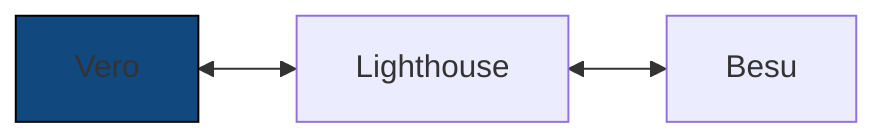
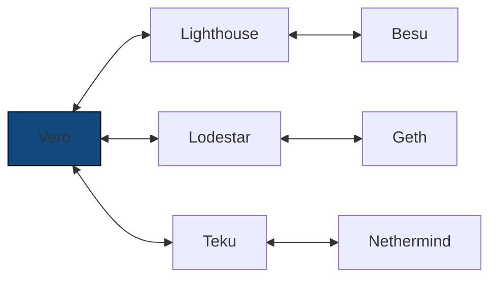

# Architecture

Vero is a validator client. To perform validator duties,
it requires access to a synced Ethereum client pair:
a Consensus Layer (CL) client (e.g. Lighthouse)
and an Execution Layer (EL) client (e.g. Besu).

___

To take full advantage of Vero's multi-node capabilities, you can connect
it to multiple CL/EL client pairs:

These client combinations do not need to run on a single machine.
In fact, we recommend running each client pair on a separate
machine for better resilience.
