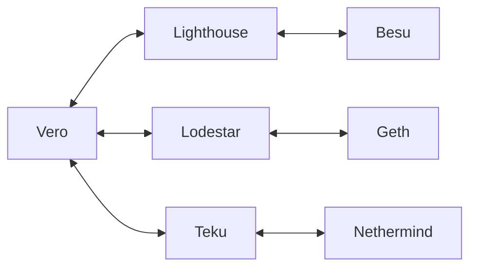

# Quick Start

## Architecture

Vero is a validator client. To perform validator duties,
Vero needs access to a synced Ethereum client combination
which consists of a Consensus Layer (CL) client
—e.g. Lighthouse— and an Execution Layer (EL) client —e.g. Besu.


To make full use of Vero's multi-node capabilities,
you can connect it to multiple client combinations:



These client combinations do not need to run on a single machine.
In fact, we recommend running every client combination on a separate
machine.

## Setting up an Ethereum client combination

There are many different ways to deploy the Ethereum
(CL and EL) client combination that Vero needs to perform
validator duties.
Some of the well known options include:

- [Dappnode](https://dappnode.com/){:target="_blank"}
- [eth-docker](https://ethdocker.com/){:target="_blank"}
- [EthPillar](https://docs.coincashew.com/ethpillar){:target="_blank"}
- [Eth Wizard](https://github.com/stake-house/eth-wizard){:target="_blank"}
- [Sedge](https://docs.sedge.nethermind.io/){:target="_blank"}

You can use any of the above options to set up your
Ethereum CL and EL client combination(s).

!!! warning

    The important thing is _**not to load your validator keys
    anywhere**_ while setting up your Ethereum clients. At this point
    you should only be running the clients, without performing
    validator duties.


## Setting up the remote signer

For security reasons, Vero never interacts directly with
validator keys. Key management is instead handled by a
remote signer, e.g. [Web3Signer](https://docs.web3signer.consensys.io/){:target="_blank"}:


While this makes things more secure, it also makes initially
setting things up a bit more complicated.

For this quick-start guide, we'll be making
our life easier and use [eth-docker](https://ethdocker.com/){:target="_blank"}
to set up both the remote signer and Vero.
Perform the following steps on the machine you intend to run
Vero on:

1. Clone eth-docker into a new "vero" directory

    `cd ~ && git clone https://github.com/ethstaker/eth-docker.git vero && cd vero`

2. Create a copy of the default config file

    `cp default.env .env`

3. Edit the config file

    `nano .env`

    and make the necessary changes to the following lines:

```
COMPOSE_FILE=vero-vc-only.yml:web3signer.yml
FEE_RECIPIENT=specify your own fee recipient address here
NETWORK=the network to use, hoodi or mainnet
WEB3SIGNER=true
CL_NODE=http://beacon-node:5052
```

Adjust the CL_NODE URL as necessary—use the IP or hostname
of the CL client you set up earlier.

___

We still haven't imported our validator keys. However, we can check
if everything is set up correctly at this point.

Run `./ethd up` to start Vero and the remote signer.
Then, run `/ethd logs validator` to check Vero's logs.

If you've set everything up correctly, you should see lines
like these in the logs:

```
WARNING: No active or pending validators detected
```

## Importing keys

!!! danger

    Running validator keys in two different places will get
    your validators slashed. Before continuing, make absolutely
    sure your validator keys are not active elsewhere.

    If you have previously used these validator keys elsewhere,
    either export & import their slashing protection data
    or ensure the validators have been offline for at least
    2 finalized epochs.

Place your validator keystores in the `vero/.eth/validator_keys`
directory.

Next, run the `./ethd keys import` command and follow the instructions.
Once your keys are imported, restart Vero using `./ethd restart validator`
and Vero will start performing duties for your validators!

Vero's logs should contain lines like this when it starts successfully:

```
INFO : Initialized beacon node at http://...
INFO : Updating duties
INFO : Started validator duty services
INFO : Subscribing to events
```
