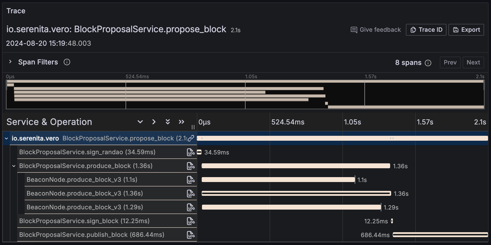

# Instrumentation

## Metrics

Vero exposes Prometheus metrics on the `/metrics` endpoint.

Vero's GitHub repository contains
[pre-buílt Grafana dashboards](https://github.com/serenita-org/vero/tree/master/grafana){:target="_blank"}.
These dashboards provide an overview of performed duties, validator status,
errors and connected beacon node scores.

  

  

  

## Tracing

Vero can export tracing data to any OpenTelemetry-compatible endpoint using the OpenTelemetry SDK.

Set the `OTEL_EXPORTER_OTLP_ENDPOINT` and `OTEL_EXPORTER_OTLP_PROTOCOL` environment variables,
and Vero will automatically push tracing data to the specified endpoint.

You can also set other OpenTelemetry-supported environment variables, such as
`OTEL_TRACES_SAMPLER` or `OTEL_RESOURCE_ATTRIBUTES` . For a full list of
supported variables, refer to the
[OpenTelemetry docs](https://opentelemetry.io/docs/specs/otel/configuration/sdk-environment-variables/){:target="_blank"}.

!!! note "Block Proposal Trace Example"

    
