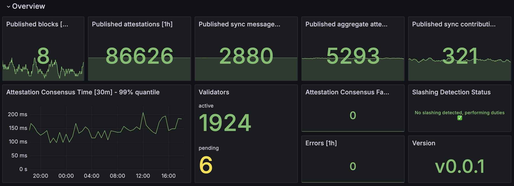

# Slashing Protection

## Proactive Measures

### Slashing Protection Database

Vero relies on the battle-tested slashing protection
provided by the attached remote signer.
An additional layer of slashing protection may be added
directly to Vero in the future.

### Doppelganger Detection

Vero supports detecting active doppelganger validators on
the network during its startup. Doppelgangers are identical
validators running elsewhere. Running the same
validator in multiple locations can lead to slashing,
as they may emit conflicting votes.

If Vero detects active doppelgangers, it will refuse to
start validator duties and shut down instead.

## Reactive Measures

### Slashing Event Detection

Vero closely monitors validator slashing events
happening on the network and **stops performing
validator duties for all of its validators
whenever it detects any of them have been
slashed**. This may seem strict, but any slashing event
should be thoroughly investigated before duties
are resumed. A slashing
event should never occur in a properly configured
environment, therefore, if such an event does occur,
it indicates a larger issue.

Vero detects slashing events in two ways:

- it listens to slashing events emitted by
connected beacon nodes in its event stream
	- This is the fastest way and ensures Vero reacts
      as soon as a slashing event is broadcast
      on the network.

- it regularly polls the status of all validators
	- This serves as a fallback mechanism if the beacon
      node fails to emit an event or Vero misses it.

The `slashing_detected` metric exposes the status of
the slashing detection mechanism and is also displayed
in the overview section of the Grafana dashboard:

