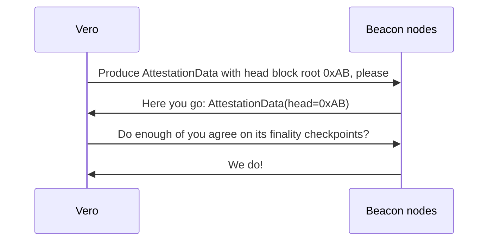
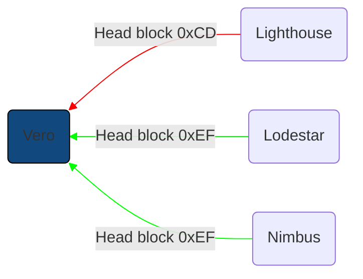
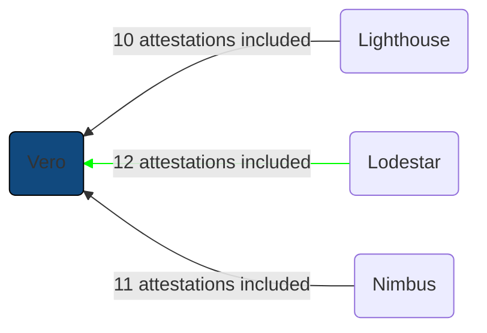
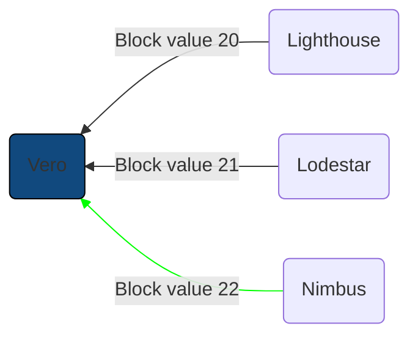

# Using multiple beacon nodes

While Vero works perfectly well when connected to
a single beacon node, its advantages truly come to
light when connected to a diverse set of clients.
Vero retrieves attestation data from all connected
beacon nodes and only attests to the chain if
a majority of them agree on its current state.
This makes
sure your validator does not attest to a buggy
version of the chain – unless the same bug affects
a majority of connected beacon nodes.

Importantly, this allows a minority of beacon nodes to be
temporarily offline, whether that is due to technical issues
or planned maintenance.

!!! note ""

    You can override the default mode of
    reaching consensus on attestation data among a majority
    of the beacon nodes using the
    `--attestation-consensus-threshold` CLI parameter.

## Attestations

When the time comes to attest to the head of the chain,
Vero requests attestation data in one of the two following
ways, depending on whether a head event has already been
seen for the current slot (before the attestation deadline).

- **A head event has already been emitted for the current slot**

    Vero attempts to submit attestation data that matches the
    head events emitted by the connected beacon nodes. It attests
    as soon as enough beacon nodes confirm the data's
    finality checkpoints (based on its configured attestation
    consensus threshold).

- **A head event has not been emitted for the
current slot by the attestation deadline
(1/3 into the slot)**

    This can happen if the block proposal is late, missed
    entirely, or processed slowly by the connected beacon
    nodes.

    Vero requests attestation data from all beacon nodes
    and attests to whichever head block is reported by
    a majority of the beacon nodes while also confirming
    finality checkpoints (based on its configured
    attestation consensus threshold).

## Aggregate attestations and sync committee contributions

When a validator is expected to publish an aggregate
attestation, Vero requests aggregate attestations
from all connected beacon nodes and publishes the
aggregate containing the most signatures, benefiting
both the validator and the wider network.
The more signatures an aggregate attestation contains,
the higher the chance it will be included in the next block.
The network works more efficiently the more attestations
are combined into aggregates.

A similar process is applied when submitting sync committee contributions.

## Block proposals

Vero requests all connected beacon nodes to produce
a block and chooses the most profitable one to publish.
This benefits both the validator and the network.
Higher-value blocks yield higher rewards for its proposer
and slightly higher rewards for all network participants
due to a higher participation rate.

