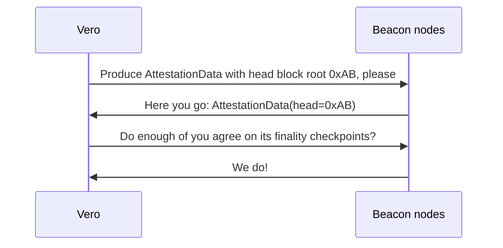
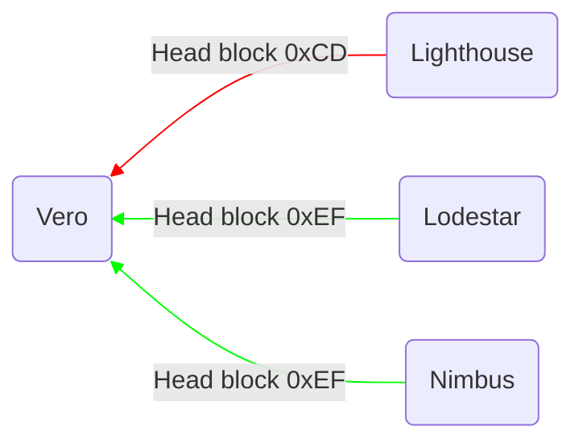
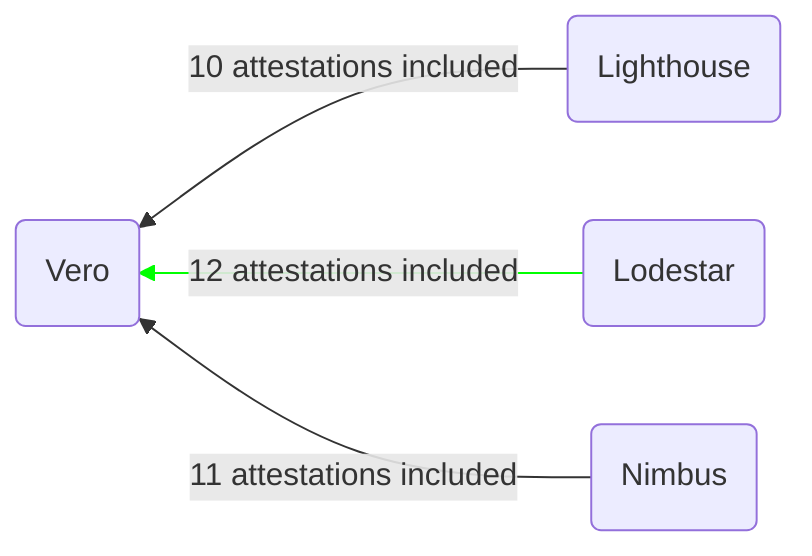
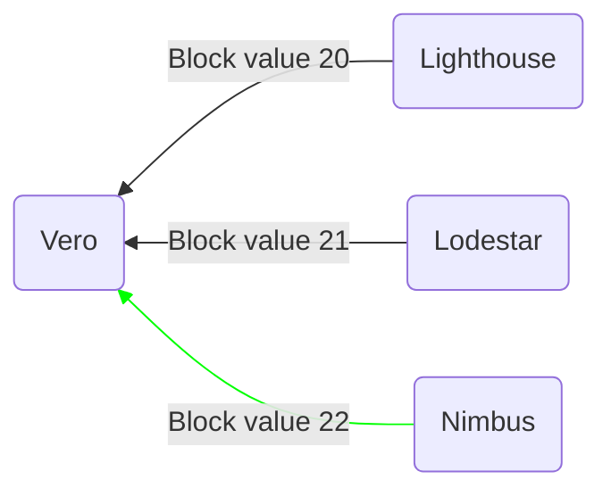

# Using multiple beacon nodes

While Vero works perfectly well when connected to
a single beacon node, its advantages truly come to
light when connected to a diverse set of clients.
Vero can, similar to [Vouch](https://github.com/attestantio/vouch){:target="_blank"},
retrieve attestation data from all of them and only
attest to the head of the chain if a majority of
connected beacon nodes agree on it. This makes
sure your validator does not attest to a buggy
version of the chain (unless enough of the connected
beacon nodes are affected by the same bug).

Importantly, this also allows for a minority of connected
beacon nodes to be temporarily offline, whether that's
because of an unexpected technical issue or for planned
maintenance.

!!! note ""

    You can override the default mode of
    reaching consensus on attestation data among a majority
    of the beacon nodes using the
    `--attestation-consensus-threshold` CLI parameter.

## Attestations

When the time comes to attest to the head of the chain,
Vero requests attestation data in one of the 2 following
ways, depending on whether a head event has already been
seen for the current slot (before the attestation deadline).

- **A head event has already been emitted for the current slot**

    Vero attempts to submit attestation data that matches the
    head events emitted by the connected beacon nodes. It attests
    as soon as enough beacon nodes have confirmed the data's
    finality checkpoints (based on its configured attestation
    consensus threshold).

```mermaid
sequenceDiagram
    Vero->>Beacon nodes: Produce AttestationData with head block root 0xAB, please
    Beacon nodes->>Vero: Here you go: AttestationData(head=0xAB)
    Vero->>Beacon nodes: Do enough of you agree on its finality checkpoints?
    Beacon nodes->>Vero: We do!
```

- **A head event has not been emitted for the
current slot by the attestation deadline
(1/3 into the slot)**

    This could be caused by multiple factors - the block
    proposal was performed late into the slot, the block
    proposal was missed entirely, or the block was processed
    slowly by the connected primary beacon node.

    Vero requests attestation data from all beacon nodes
    and attests to whichever head block is reported by
    a majority of the beacon nodes while also confirming
    finality checkpoints (based on its configured
    attestation consensus threshold).

```mermaid
flowchart RL
CL-A(Lighthouse) --> |Head block 0xCD| V(Vero)
CL-B(Lodestar) --> |Head block 0xEF| V(Vero)
CL-C(Nimbus) --> |Head block 0xEF| V(Vero)

%% Apply green color to links with Head block root 0xEF
linkStyle 0 stroke:#FF0000
linkStyle 1 stroke:#00FF00
linkStyle 2 stroke:#00FF00
```

## Aggregate attestations and sync committee contributions

When a validator is expected to publish an aggregate
attestation, Vero requests aggregate attestations
from all connected beacon nodes and publishes the
aggregate containing the most signatures, benefiting
both the validator and the broader network.
The validator has a higher chance of getting its
attestation included in the next block the more
signatures the aggregated attestation contains.
The network works more efficiently the more attestations
are combined into aggregates.

A similar process is applied when submitting sync committee contributions.

```mermaid
flowchart RL
CL-A(Lighthouse)  -->  |10 attestations included| V(Vero)
CL-B(Lodestar)  -->  |12 attestations included| V(Vero)
CL-C(Nimbus)  -->  |11 attestations included| V(Vero)

%% Apply green color to link with highest amount of included attestations
linkStyle 1 stroke:#00FF00
```

## Block proposals

Vero requests all connected beacon nodes to produce
a block and chooses the most profitable one to publish.
This again benefits both the validator and the network.
More included attestations mean higher rewards for
the block proposer as well as slightly higher rewards
for all network participants thanks to the higher
participation rate.

```mermaid
flowchart RL
CL-A(Lighthouse)  -->  |Block value 20| V(Vero)
CL-B(Lodestar)  -->  |Block value 21| V(Vero)
CL-C(Nimbus)  -->  |Block value 22| V(Vero)

%% Apply green color to link with highest block value
linkStyle 2 stroke:#00FF00
```
