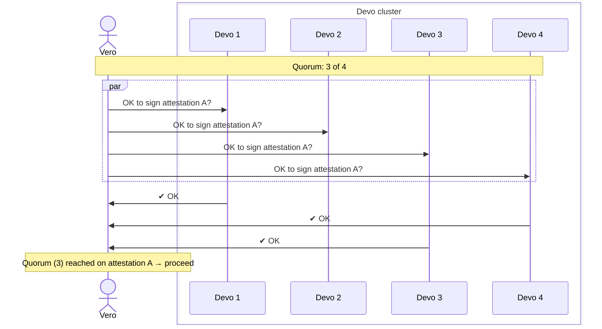

# Exclusive Features

This section documents features available to Vero Sponsors.  These features are
not part of the core open-source release.

## Devo

Devo is a distributed slashing protection service.

It acts as an external approval layer between Vero and duty publication. Before
publishing attestations or blocks, Vero submits the proposed signing data to
Devo for validation.

Each Devo instance maintains a local database with the latest attestation and
block record per validator. When a duty is submitted, Devo checks it against
slashing protection rules, records it if valid, and only returns success if it
is safe to publish.

Instead of relying on a single local database, this state is replicated across
multiple independent Devo instances. Vero queries these instances in parallel
and proceeds only after reaching quorum.

Because slashing protection is externalized, multiple Vero instances can run
concurrently without coordinating local state. Devo acts as the shared
coordination layer, ensuring that only safe duties are approved. This enables
active-active deployments without introducing slashing risk.

In production, Vero typically queries several Devo instances and requires a
quorum of successful responses before publishing. For example, in a four-node
Devo cluster, Vero may require three approvals. This allows the system to
tolerate a failed or slow instance while preserving safety guarantees.

### Architecture Diagram

## Automatic Failover

!!! example "This feature is considered experimental at this stage."

Automatic failover is a Vero high-availability mode where one Vero instance acts as
the primary and another acts as the secondary. During normal operation, the primary
instance performs validator duties and exposes a healthcheck endpoint. The secondary
instance monitors that healthcheck but does not perform duties while the primary is
healthy.

**Both Vero instances must be connected to the same Devo instances**. This is what
keeps failover safe: when the secondary takes over, it continues checking and
updating the same shared slashing protection layer that the primary was using.

If the primary instance reports as unhealthy, the secondary automatically starts
performing duties. This prevents resource contention during normal operation, because
only the primary is active while it is healthy, while still minimizing downtime when
the primary becomes unavailable.
