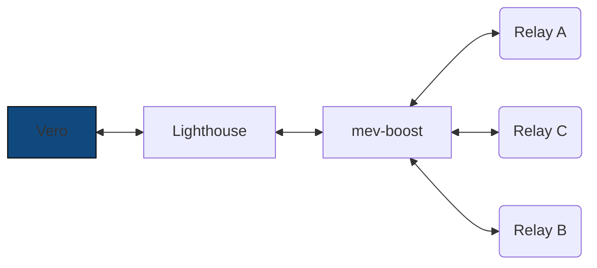
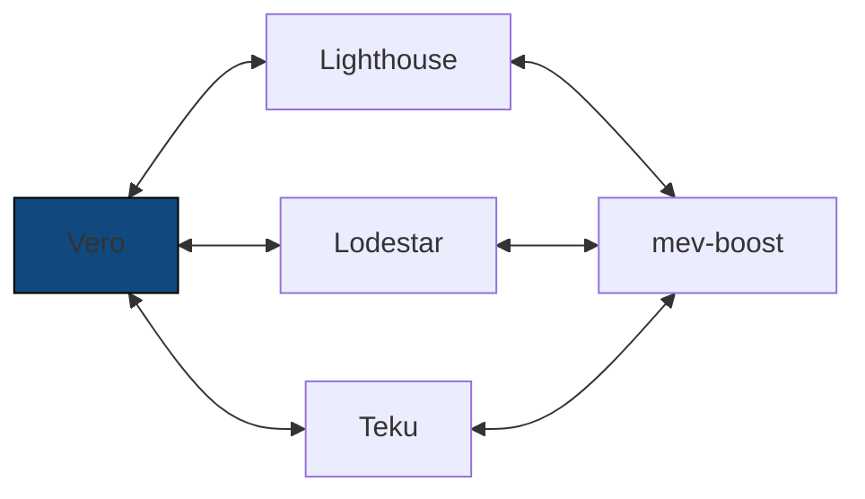
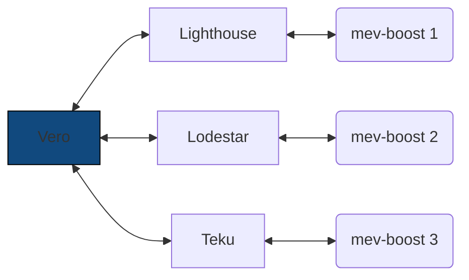

# MEV Configuration

For MEV, Vero behaves like a traditional validator client.
Vero does not communicate directly with MEV relays.
Instead, connected beacon nodes handle that role through
sidecars like
[mev-boost](https://github.com/flashbots/mev-boost){:target="_blank"} or [Commit-Boost](https://www.commit-boost.org/){:target="_blank"}.

If you want Vero to use external builders when proposing
blocks, all you need to do is pass the
`--use-external-builder` CLI flag. With this flag,
Vero will regularly register its connected validators
with MEV relays.

## MEV and multiple beacon nodes

By default, Vero uses the first connected beacon node
to submit its validator registrations
(=&nbsp;the first URL provided in the `--beacon-node-urls` CLI argument).

Therefore, ensure that the first connected beacon node is
connected to all the MEV relays you wish to use.

Having said that, there are multiple choices you can make
when it comes to setting this up in a multi-client environment.

___

Option 1: Point all beacon nodes to a single mev-boost instance:

Option 2: Deploy a separate mev-boost instance for each client pair:

