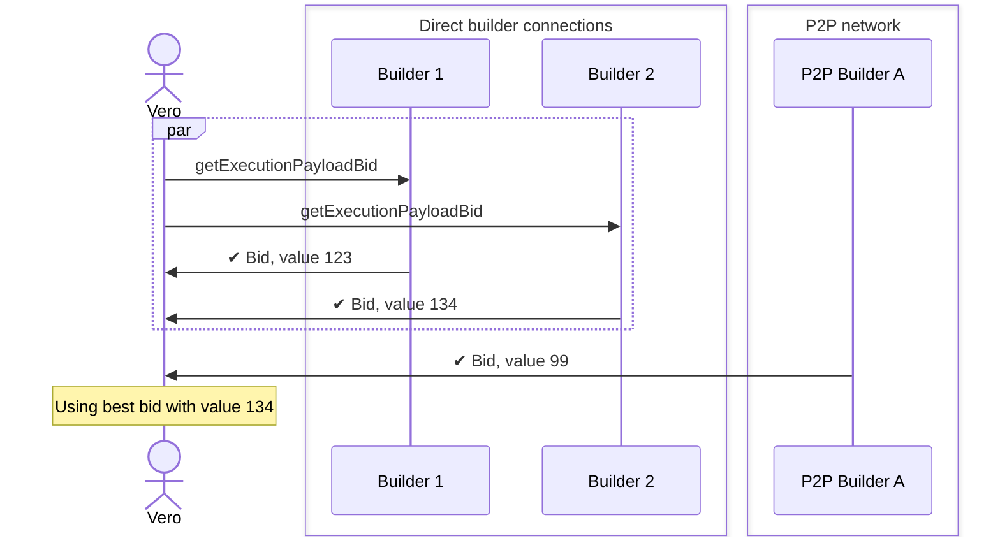
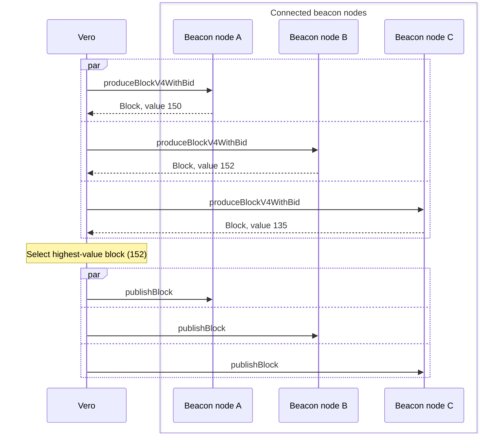
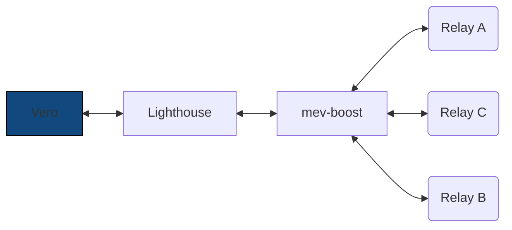
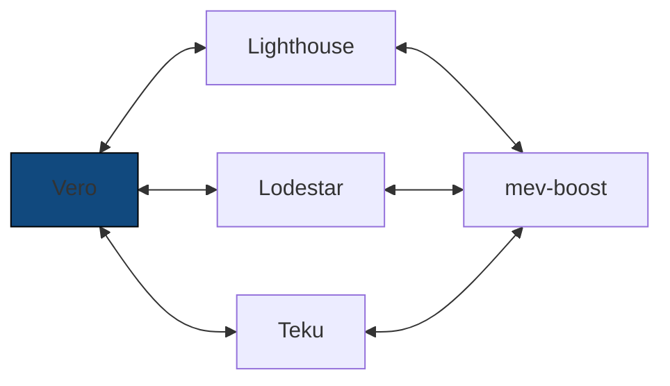
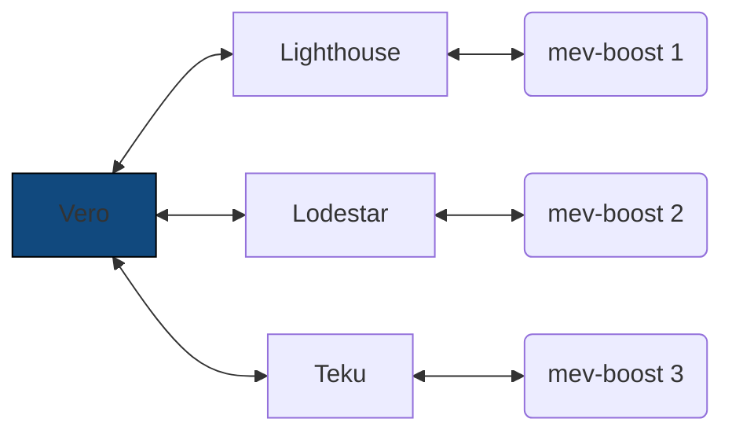

# MEV Configuration

## Post-Gloas

After the Gloas fork, Vero can take over some of the MEV-related responsibilities.
You can opt out of the behavior below by passing the `--disable-bid-selection` CLI flag,
in which case Vero will behave like a traditional validator client and leave bid
selection to the connected beacon nodes.

### Bid selection

Based on your preferences (`--builder-urls`, `--builder-boost-factor`,
`--builder-min-bid`, `--builder-max-execution-payment`) Vero selects
a bid whenever a block proposal duty is scheduled, looking at bids returned
directly by builders as well as bids sourced from the connected beacon nodes'
peer-to-peer network.

```mermaid
sequenceDiagram
    actor Vero as Vero

    box Direct builder connections
        participant B1 as Builder 1
        participant B2 as Builder 2
    end

    box P2P network
        participant PA as P2P Builder A
    end

    par
        Vero->>B1: getExecutionPayloadBid
        Vero->>B2: getExecutionPayloadBid
        B1->>Vero: ✔ Bid, value 123
        B2->>Vero: ✔ Bid, value 134
    end

    PA->>Vero: ✔ Bid, value 99

    Note over Vero: Using best bid with value 134
```

!!! note "What if there are no bids?"

    If Vero is unable to select a bid, it falls back to traditional
    validator client behavior, letting the connected beacon nodes
    select a bid or fall back to building a local payload.

### Block production

Once a bid has been selected, Vero asks the connected beacon nodes
to produce a block using the selected bid.

Each of the connected beacon nodes then produces a block using the
selected bid. The blocks returned may differ slightly in value, and Vero
will again select the block with the highest value. Vero then signs the
block and publishes it using the connected beacon nodes.

!!! warning

    The beacon nodes may produce a block using a different bid than the one
    supplied by Vero. This can happen when the beacon node determines the bid
    to be invalid, or when the beacon node's view of the chain differs and is
    incompatible with the supplied bid.

```mermaid
sequenceDiagram
    participant Vero as Vero

    box Connected beacon nodes
        participant BA as Beacon node A
        participant BB as Beacon node B
        participant BC as Beacon node C
    end

    par
        Vero->>BA: produceBlockV4WithBid
        BA-->>Vero: Block, value 150
    and
        Vero->>BB: produceBlockV4WithBid
        BB-->>Vero: Block, value 152
    and
        Vero->>BC: produceBlockV4WithBid
        BC-->>Vero: Block, value 135
    end

    Note over Vero: Select highest-value block (152)

    par
        Vero->>BA: publishBlock
    and
        Vero->>BB: publishBlock
    and
        Vero->>BC: publishBlock
    end
```

___

## Pre-Gloas

When it comes to MEV, Vero behaves like a traditional validator client – it
does not communicate directly with MEV relays.
Instead, connected beacon nodes should handle that role through
sidecars like
[mev-boost](https://github.com/flashbots/mev-boost){:target="_blank"} or [Commit-Boost](https://www.commit-boost.org/){:target="_blank"}.

```mermaid
flowchart RL

Lighthouse <--> Vero
mev-boost <--> Lighthouse
RA(Relay A) <--> mev-boost
RB(Relay C) <--> mev-boost
RC(Relay B) <--> mev-boost

style Vero fill:#11497E,stroke:#000000
```

If you want Vero to use external builders when proposing
blocks, all you need to do is pass the
`--use-external-builder` CLI flag. With this flag,
Vero will regularly register its connected validators
with MEV relays.

### MEV and multiple beacon nodes

For validator registrations, Vero uses a single beacon node
to avoid overwhelming MEV relays with duplicate registrations.
It selects the currently highest-scoring connected node.

When node scores are equal, this defaults to the first URL in
`--beacon-node-urls`.
If that beacon node's score drops (e.g. due to downtime or slow responses),
Vero automatically fails over to the next highest-scoring beacon node.

Therefore, ensure all connected beacon nodes are configured to reach
all MEV relays you intend to use.

There are multiple choices you can make
when it comes to setting this up in a multi-client environment.

#### Option 1: Point all beacon nodes to a single mev-boost instance:

```mermaid
flowchart RL

%% VC<->CL
Lighthouse <--> Vero
Lodestar <--> Vero
Teku <--> Vero

%% CL<->EL
mev-boost <--> Lighthouse
mev-boost <--> Lodestar
mev-boost <--> Teku

style Vero fill:#11497E,stroke:#000000
```

#### Option 2: Deploy a separate mev-boost instance for each client pair:

```mermaid
flowchart RL

%% VC<->CL
Lighthouse <--> Vero
Lodestar <--> Vero
Teku <--> Vero

%% CL<->EL
MB1(mev-boost 1) <--> Lighthouse
MB2(mev-boost 2) <--> Lodestar
MB3(mev-boost 3) <--> Teku

style Vero fill:#11497E,stroke:#000000
```
