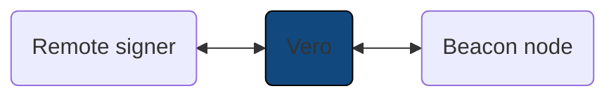

# Running Vero

!!! info "Prerequisites"

    - Vero requires a remote signer to manage validator
      keys — it intentionally never has direct access to them.
    - The remote signer **must** be connected to a slashing protection
      database — **Vero does not maintain its own!**

