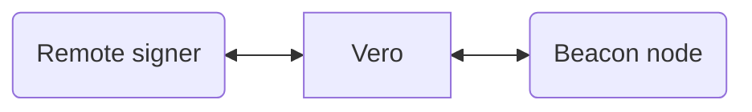

# Running Vero

!!! info "Prerequisites"

    - Vero requires a remote signer to manage your validator
      keys — Vero intentionally never has direct access to validator keys.
    - The remote signer **must be** connected to a slashing protection
      database — **Vero does not maintain its own slashing protection
      database!**

```mermaid
flowchart RL

%% Signer<->VC
Vero <--> RS(Remote signer)

%% VC<->CL
BN(Beacon node) <--> Vero
```
