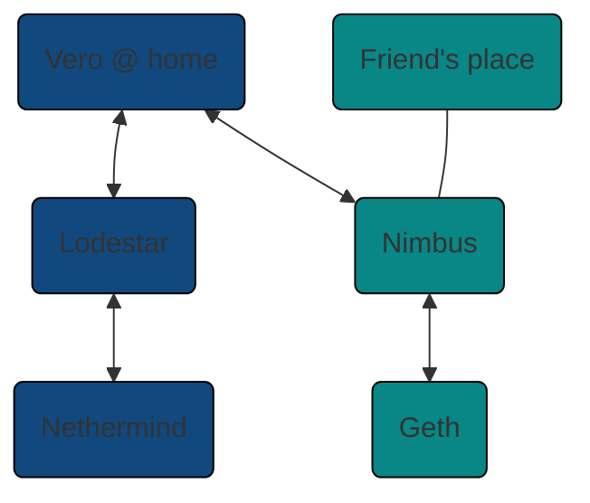

# Home stakers

Many home stakers run a fallback beacon node, either
at their own home or at a friend's place. As long
as these are relatively close to each other, home
stakers could benefit from using Vero and connecting
it to both beacon nodes. Running different client pairs
on these servers ensures your validator
only attests when both client implementations agree
on the state of the chain.

Here's an example setup with one node at home
and another at a friend's place:

A two-node setup does have a downside, however.
If either node goes offline, Vero will stop attesting
at the next epoch transition because it cannot
confirm the next set of finality checkpoints.
For that reason, Vero works best with at least three
client pairs, which allows maintenance on any one pair
at a time without downtime.
