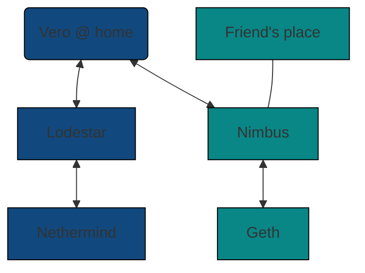

# Home stakers

Many home stakers use a fallback beacon node, either
located at their home or at a friend's place. As long
as they are relatively close to each other, home
stakers could benefit from using Vero and connecting
it to both beacon nodes. Running different sets of
clients on these servers will make sure your validator
will only attest if both client implementations agree
on the state of the chain.

```mermaid
flowchart TD

V(Vero @ home) <--> Lodestar
V <--> Nimbus
Lodestar <--> Nethermind
Friend's&nbspplace --- Nimbus
Nimbus <--> Geth

%% Apply colors to nodes based on location
style V fill:#11497E,stroke:#000000
style Lodestar fill:#11497E,stroke:#000000
style Nethermind fill:#11497E,stroke:#000000
style Nimbus fill:#098686,stroke:#000000
style Geth fill:#098686,stroke:#000000
style Friend's&nbspplace fill:#098686,stroke:#000000
```

A 2-node setup does have a slight downside though.
Taking any of the two nodes offline will make
Vero stop attesting at the next epoch transition
since it will be unable to confirm the next set
of finality checkpoints.
For that reason, Vero works best with at least 3
client combinations, allowing the node operator
to perform maintenance on any one of them at a time.
