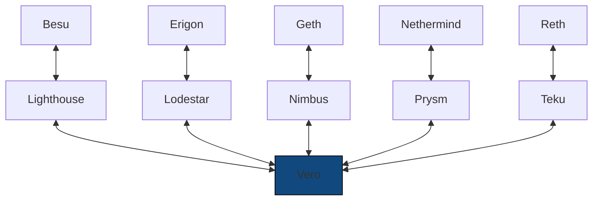

# Professional node operators

Professional node operators should run
a diverse set of clients and decide which chain to attest
to based on their combined output. Until now, this was only
possible through Vouch. Vero introduces an alternative
that is easier to adopt and can be adopted gradually.

Vero is compatible with all CL and EL clients
(see [compatibility](../compatibility.md)),
therefore we recommend running up to five different
client pairs and ensuring that no single client runs
on a majority of servers. This will ensure validators
are not exposed to single-client bugs and also allows
for maintenance to be performed on up to two servers
at a time.

___

## Step-by-step Migration Example

Let's assume you're a professional node operator, running validator
clients developed by CL client teams, connected to a 50% mix of
Geth-Prysm (5 servers) and Nethermind-Lighthouse (5 servers).
You already have a remote signer set up with an enabled slashing
protection database.

This setup is already much safer than running only
supermajority clients, but it still exposes your
validators to risks such as:

- [33% consensus client bugs](https://x.com/potuz_eth/status/1768418899111113125){:target="_blank"}
- fallback behavior bugs – for example, if the Nethermind nodes
  fail or fall behind because of an invalid block,
  your validator client *may* automatically fall back to using
  the Geth nodes that haven't fallen behind

To migrate to a more resilient setup using Vero, you would:

1. **Start using Vero as your validator client.**

    This step should be very easy to perform if you're already using
    a remote signer.
    If you end up not liking Vero, switching back to your previous
    validator client is very easy.

2. **Start introducing more clients onto your servers gradually**.

    Switch to a Lodestar CL client on one of them. Then switch to the
    Besu EL client on another. Continue switching clients one by one until
    you reach your desired end state while keeping an eye on Vero metrics,
    especially the attestation consensus time and duty submission time.
    With five servers, you could easily be running five different CL clients
    and five different EL clients. Vero is compatible with all of them.

3. **Enjoy the peace of mind a diverse set of clients gives you.**

    When a single client has a bug, you don't need to step in
    immediately since Vero will simply keep going using the other
    clients in the mix.

    Even if two clients share a bug, the 3 other clients will
    keep things going!

*The ultimate setup for professional node operators?*

Besides being resilient against single-client bugs,
this kind of setup also allows you to gradually introduce new
clients that may not be completely battle-tested yet, like
[Grandine](https://github.com/grandinetech/grandine){:target="_blank"} or
[Reth](https://github.com/paradigmxyz/reth){:target="_blank"}.

If you're a professional node operator not yet running
a multi-node setup, do yourself —and the network— a favor
and start to use Vero.
