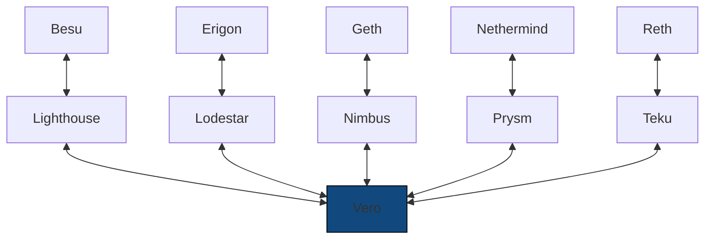

# Professional node operators

Professional node operators should run
a diverse set of clients and decide which chain to attest
to based on their combined output. Until now, this was only
possible through Vouch. Vero introduces an alternative
that is easier to adopt and can be adopted gradually.

Vero is compatible with all CL and EL clients
(see [compatibility](../compatibility.md)),
therefore we recommend running up to five different
client pairs and ensuring that no single client runs
on a majority of servers. This will ensure validators
are not exposed to single-client bugs and also allows
for maintenance to be performed on up to two servers
at a time.

___

!!! tip "Become a Vero Sponsor"

    Consider supporting Vero's development by becoming an official **Vero Sponsor**.

    Sponsors get access to exclusive features designed to make
    validator operations even more reliable, including
    **high availability** and access to **priority support**.

___

## Step-by-step Migration Example

Let's assume you're a professional node operator, running validator
clients developed by CL client teams, connected to a 50% mix of
Geth-Prysm (5 servers) and Nethermind-Lighthouse (5 servers).
Let's also assume you already have a remote signer set up
with an enabled slashing protection database.

This setup is safer than only running a single client
implementation but it still exposes your
validators to risks such as:

- [33% consensus client bugs](https://x.com/potuz_eth/status/1768418899111113125){:target="_blank"}
- fallback behavior bugs – for example, if your Nethermind nodes
  reject an invalid block, your validator client *may* automatically
  fall back to using your Geth nodes which could consider that block
  valid due to a bug

To migrate to a more resilient setup using Vero, you would:

1. **Switch to using Vero as your validator client.**

    This step should be easy to perform if you're already using
    a remote signer. You only switch a single component
    within your setup, the validator client, _without any slashing risk_.
    In case of need, switching back to the validator client you used
    previously is equally easy.

2. **Start introducing more clients onto your servers gradually**.

    Switch to the Lodestar client on one of them. Then switch to the
    Besu client on another. Continue switching clients one by one until
    you reach your desired end state while keeping an eye on Vero metrics,
    especially the attestation consensus time and duty submission time.
    With five servers, you could easily be running five different CL clients
    and five different EL clients. Vero is compatible with all of them.

3. **Enjoy the peace of mind a diverse set of clients gives you.**

    Whenever any single client has a bug, you don't need to step in
    immediately since Vero will simply keep going using the other
    clients in the mix. Even if two clients share an identical bug,
    the three other clients will keep things going without any
    action required on your part!

    If you want to be extra conservative around network upgrades,
    when client bugs are more likely to surface, you can temporarily
    increase Vero's attestation consensus threshold. You could require four,
    or even all five of the connected clients to agree on the state of
    the chain before your validators vote for it.

*The ultimate setup for professional node operators?*

Besides being resilient against single-client bugs,
this kind of setup also allows you to gradually introduce new
clients that may not be completely battle-tested yet, like
[Grandine](https://github.com/grandinetech/grandine){:target="_blank"} or
[Reth](https://github.com/paradigmxyz/reth){:target="_blank"}.

If you're a professional node operator not yet running
a multi-node setup, do yourself —and the network— a favor
and start using Vero.
