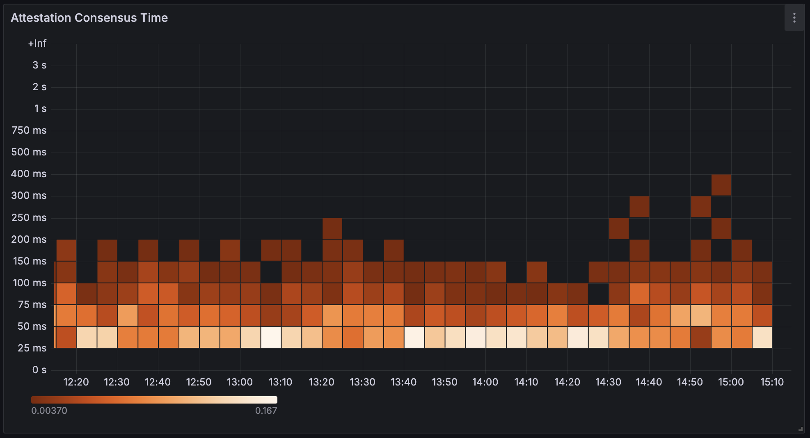
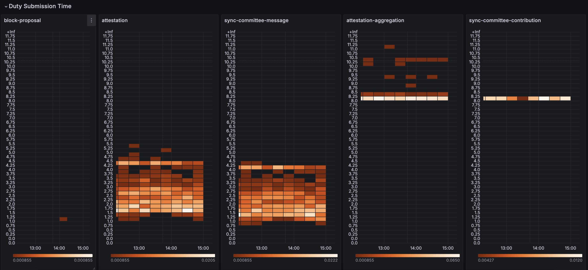
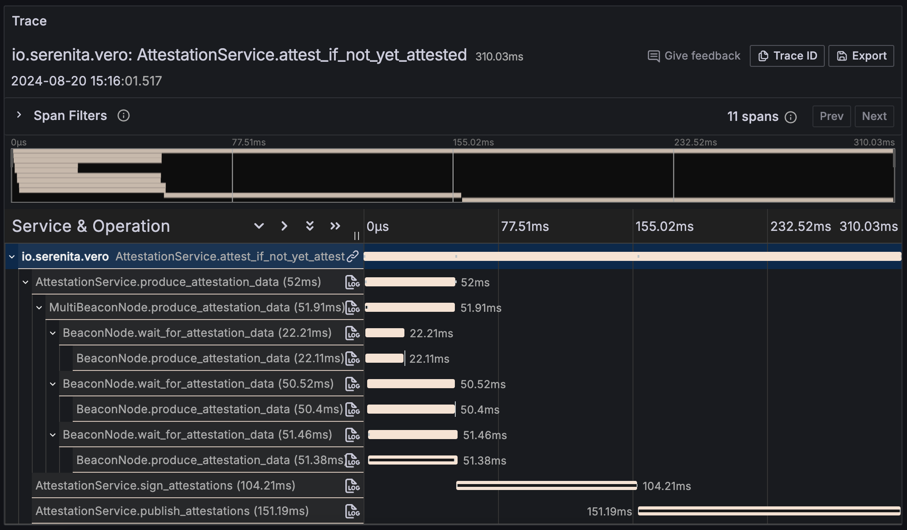
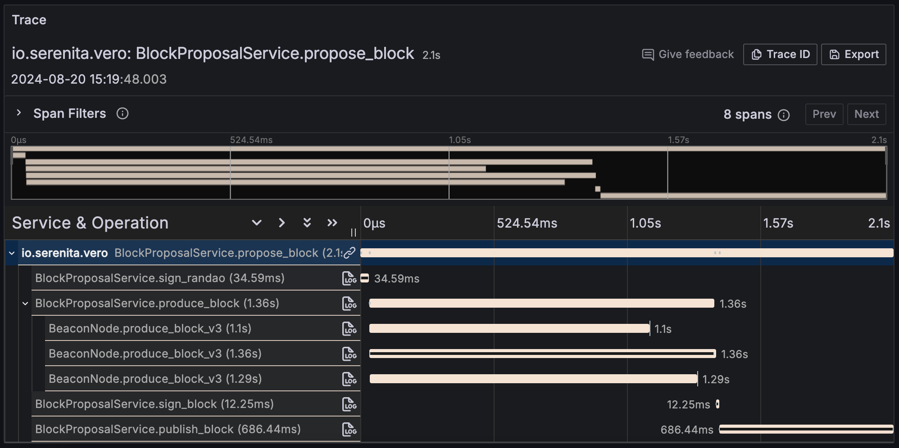

# Instrumentation

## Metrics

Vero exposes Prometheus metrics by default on the `/metrics` endpoint.

This repository contains Grafana dashboards, see [grafana](../grafana). These provide an overview of performed duties, validator status, errors and connected beacon node scores.

  

  

  

## Tracing

Vero can export tracing data to an OpenTelemetry-compatible endpoint using OpenTelemetry's SDK.

Set the `OTEL_EXPORTER_OTLP_ENDPOINT` and `OTEL_EXPORTER_OTLP_PROTOCOL` (grpc) environment variables and tracing data will automatically be pushed to the specified endpoint.

You may also set other OpenTelemetry-supported environment variables like `OTEL_TRACES_SAMPLER` or `OTEL_RESOURCE_ATTRIBUTES` . For a full list of supported variables refer to [https://opentelemetry.io/docs/specs/otel/configuration/sdk-environment-variables/](https://opentelemetry.io/docs/specs/otel/configuration/sdk-environment-variables/).

### Examples

#### Attestation

#### Block Proposal

## Profiling

*(The latest Pyroscope SDK does not yet support Python 3.12 which Vero uses, therefore
this form of instrumentation does not currently work.)*

Vero supports continuous profiling using [Grafana Pyroscope's Python SDK](https://grafana.com/docs/pyroscope/latest/configure-client/language-sdks/python/). Profiling data is linked to traces, making it possible to inspect profiles for specific trace spans in Grafana using its ["Traces to profiles" feature](https://grafana.com/docs/pyroscope/latest/view-and-analyze-profile-data/profile-tracing/traces-to-profiles/).

Set the `PYROSCOPE_SERVER_ADDRESS` environment variable and optionally add tags in the `PYROSCOPE_TAGS` environment variable in the following comma-separated format: `tag-name-1=tag-value-1,tag-name-2=tag-value-2`.

<!-- TODO example image(s)-->

Exporting profiling data is not recommended during normal usage and is mostly intended to be used to investigate performance issues.
