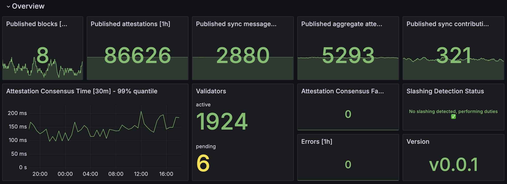

# Slashing protection

## Prevention

At the time of writing, Vero does not maintain its own
slashing protection database and instead relies on the
battle-tested slashing protection measures of the
remote signer, similar to Vouch. Another layer of
slashing protection may be added to Vero itself
in the future.

## Detection

Vero closely monitors and attempts to detect validator
slashing events as quickly as possible
and **stops performing all duties for all of its
validators whenever it detects any of them have
been slashed**. This may sound excessive but we
believe any slashing event should be thoroughly
investigated before resuming duties. A slashing
event should never occur in a well-setup environment,
therefore if such an event does occur, it indicates
a larger issue.

Vero detects slashing events in 2 ways:

- it listens to slashing events emitted by
connected beacon nodes in its event stream
	- This is one of the fastest ways to detect
      a slashing event and ensures Vero reacts
      to these as quickly as possible.

- it regularly polls the status of all validators
	- This is a fallback mechanism in case the beacon
      node does not emit a slashing event or Vero
      fails to process it.

A metric - `slashing_detected` - exposes the status of
the slashing detection mechanism and is also displayed
in the overview section of the Grafana dashboard:

