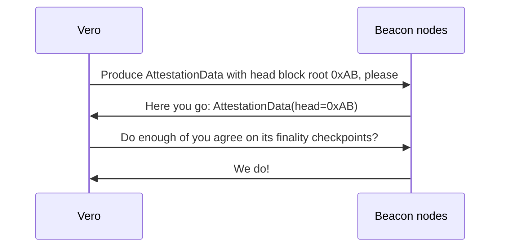
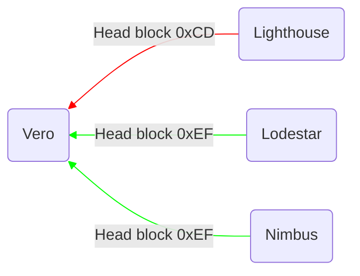
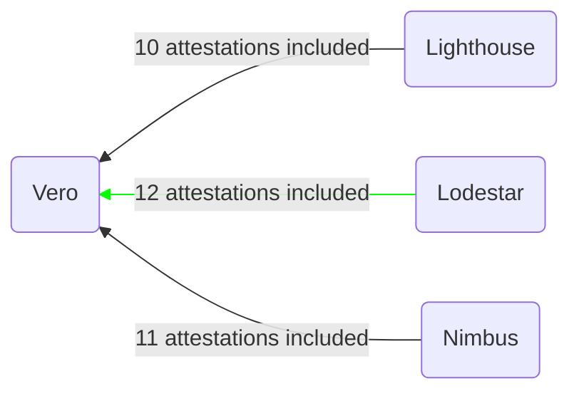
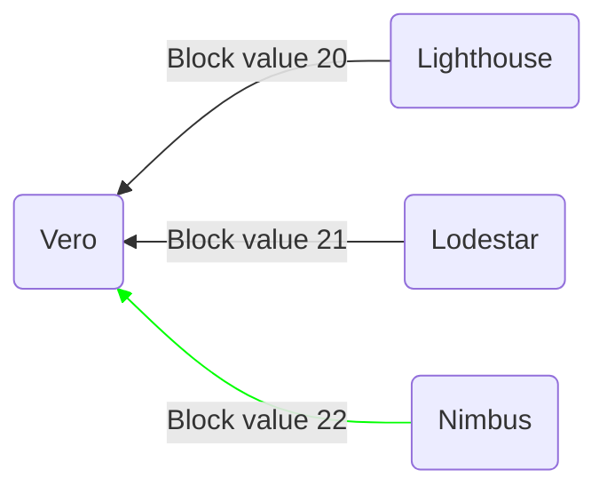
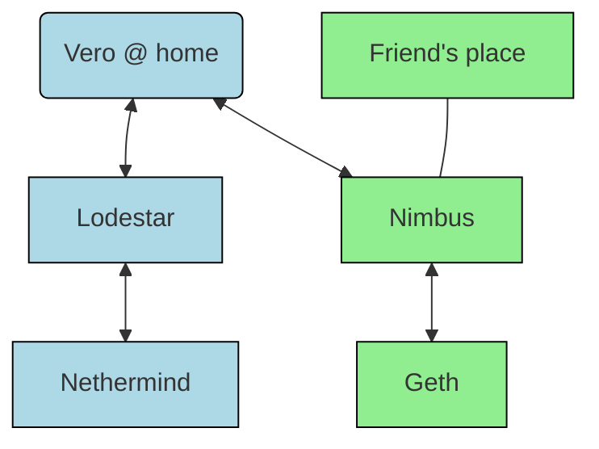
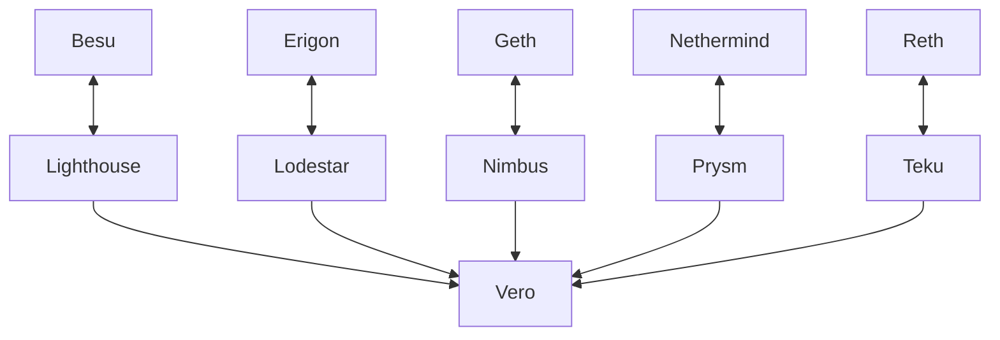

# Using multiple beacon nodes

While Vero works perfectly well when connected to
a single beacon node, its advantages truly come to
light when connected to a diverse set of beacon nodes.
Vero can, similar to [Vouch](https://github.com/attestantio/vouch),
retrieve attestation data from all of them and only
attest to the head of the chain if a majority of
connected beacon nodes agree on it. This makes
sure your validator does not attest to a buggy
version of the chain (unless enough of the connected
beacon nodes are affected by the same bug).

Importantly, this also allows for a minority of connected
beacon nodes to be temporarily offline, whether that's
because of an unexpected technical issue or for planned
maintenance.

Note: it is possible to override the default mode of
reaching consensus on attestation data among a majority
of the beacon nodes using the
`--attestation-consensus-threshold` CLI parameter.

## Attestations

When the time comes to attest to the head of the chain,
Vero requests attestation data in one of the 2 following
ways, depending on whether a head event has already been
seen for the current slot (before the attestation deadline).

- **A head event has already been emitted for the current slot**

Vero attempts to submit attestation data that matches the
head events emitted by the connected beacon nodes. It attests
as soon as enough beacon nodes have confirmed the data's
finality checkpoints (based on its configured attestation
consensus threshold).

- **A head event has not been emitted for the
current slot by the attestation deadline
(1/3 into the slot)**

This could be caused by multiple factors - the block
proposal was performed late into the slot, the block
proposal was missed entirely, or the block was processed
slowly by the connected primary beacon node.

Vero requests attestation data from all beacon nodes
and attests to whichever head block is reported by
a majority of the beacon nodes while also confirming
finality checkpoints (based on its configured
attestation consensus threshold).

## Aggregated attestations and sync committee contributions

When a validator is expected to publish an aggregated
attestation, Vero requests aggregated attestations
from all connected beacon nodes and publishes the
aggregate containing the most signatures, benefiting
both the validator and the broader network.
The validator has a higher chance of getting its
attestation included in the next block the more
signatures the aggregated attestation contains.
The network works more efficiently the more attestations
are combined into aggregates.

The same process is applied for sync committee contributions.

## Block proposals

Vero requests all connected beacon nodes to produce
a block and chooses the most profitable one to publish.
This again benefits both the validator and the network.
More included attestations mean higher rewards for
the block proposer as well as slightly higher rewards
for all network participants thanks to the higher
participation rate.

# Setup recommendations

#### *Note on latency*

*Vero has so far been successfully tested with
beacon nodes spanning a single continent. It has
not been tested with beacon nodes spanning several
continents. If you feel like trying that kind of
setup out, please do report back with your results.*

*Vero does not always need to collect responses
from all the connected beacon nodes. If the
fastest responses form a majority of connected
beacon nodes agree, it will not wait for the rest
of the responses to come in and will move on.
These kinds of measures are in place to make sure
a single slow or unresponsive beacon node won't
affect the validator duties.*

## Home stakers

Many home stakers use a fallback beacon node, either
located at their home or at a friend's place. As long
as they are relatively close to each other, home
stakers could benefit from using Vero and connecting
it to both beacon nodes. Running different sets of
clients on these servers will make sure your validator
will only attest if both of those sets of client
implementations agree on the state of the chain.

A 2-node setup does have a slight downside though
\- taking any of the two CL clients (or its connected
EL clients) offline will make Vero stop attesting
at the next epoch transition (it will be unable
to confirm the next set of finality checkpoints).
For that reason Vero works best with at least 3
client combinations, allowing you to perform
maintenance on one of them at a time.

## Professional operators

Large professional node operators should ideally run
a diverse set of clients and decide what to do based
on their combined output. Until now, this was only
possible through Vouch or DVT. Vero introduces another
way that is much easier to migrate to and can be
migrated to gradually.

Vero is compatible with all CL and EL clients
(see [compatibility](./compatibility.md)),
therefore we'd recommend to run up to 5 different
client combinations with neither client running on
a majority of these servers. This will ensure validators
are not exposed to single-client bugs and also make it
possible to perform maintenance on up to 2 connected
servers.

### Migration example

Let's assume you're a professional node operator, running validator
clients developed by CL client teams, connected to a 50% mix of
Geth-Prysm (5 servers) and Nethermind-Lighthouse (5 servers).
You already have a remote signer set up with an enabled slashing
protection database.

The setup described above is already much better than running only
supermajority clients, but still exposes your validators to various
risks, like:

- [33% consensus client bugs](https://x.com/potuz_eth/status/1768418899111113125)
- fallback behavior bugs - in case the Nethermind nodes
  fail or start falling behind because of an invalid block,
  your validator client *may* automatically fall back to using
  the Geth nodes that haven't fallen behind

To migrate to a more resilient setup using Vero, you would:

1. **Start using Vero as your validator client.** This step
should be very easy to perform if you're already using a remote signer.
If you end up not liking Vero, switching back to your previous
validator client is very easy.

2. **Start introducing more clients onto your servers gradually**.
Switch to a Lodestar CL client on one of them. Then switch to the
Besu EL client on another. Continue switching clients one-by-one until
you reach your desired end state while keeping an eye on Vero metrics,
especially the attestation consensus time and duty submission time.
With 5 servers, you could easily be running 5 different CL clients
and 5 different EL clients! Vero is compatible with all of them.

3. **Enjoy the peace of mind a diverse set of nodes gives you.** You
no longer have to react immediately when a single client has
a bug - Vero will keep chugging along using the rest of your nodes.
**Best of all - this benefits the rest of the network too!**

*The ultimate setup for professional node operators?*

Besides being as resilient as can be against single-client bugs,
this kind of setup also allows you to gradually introduce new
clients that may not be completely battle-tested yet, like
[Grandine](https://github.com/grandinetech/grandine) or
[Reth](https://github.com/paradigmxyz/reth).

If you're a professional node operator and you're not yet
running a multi-node setup, do yourself –and the network– a favor
and start using Vero.
